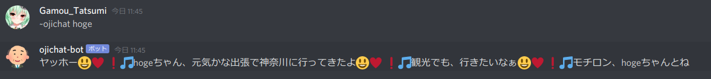

# ojichat_rs_discordbot

[ojichat_rs](https://github.com/gamoutatsumi/ojichat_rs)を使用したDiscord Botです。

## 使い方

バイナリをそのまま実行する方法と、Dockerを使用する方法があります。

### バイナリそのまま

crates.ioには上げていないので、gitを通してインストールします。

Rust環境が必要です。

```bash
cargo install --git https://github.com/gamoutatsumi/ojichat_rs
```

環境変数にbotのトークンを入れる必要があります。

`.env` ファイルにも対応しています。実行する時のカレントディレクトリにファイルを配置してください。

```text
DISCORD_TOKEN=<botのトークン>
```

```bash
$ ojichat-rs-disbot
<bot-name> is connected!
```

### Docker経由

Docker Hubに上がってます。

相変わらず環境変数が必要なのでdocker-composeの利用をおすすめします。

ここでは例として `--env-file` を使います。

どうやら `--init` を使わないと `SIGINT` が上手くハンドリングされないみたいです。(いわゆるPID=1問題)

Rust側でシグナルを処理するように書けば良さそうなので余裕がある時に直したい。

```bash
docker pull gamout/ojichat-rs-disbot:latest
docker run --init --rm --env-file=./.env gamout/ojichat-rs-disbot:latest
<bot-name> is connected!
```



## botコマンド

### `~ojichat <絵文字連続挿入数> <句読点挿入レベル> <相手の名前>`

おじさんが喋ります。

オプションとして、絵文字がどれだけ連続するか、句読点をどれだけ入れるか、誰の名前で喋らせたいかを指定できます。

メンションも飛ばせます。
